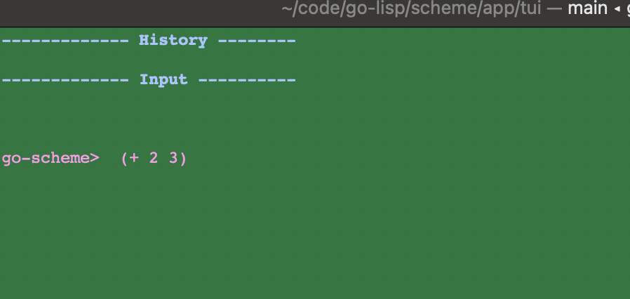
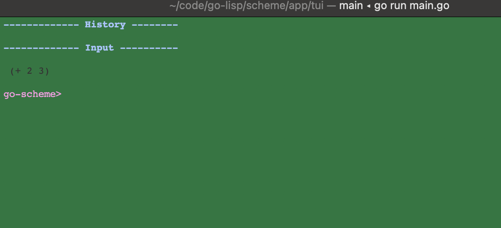
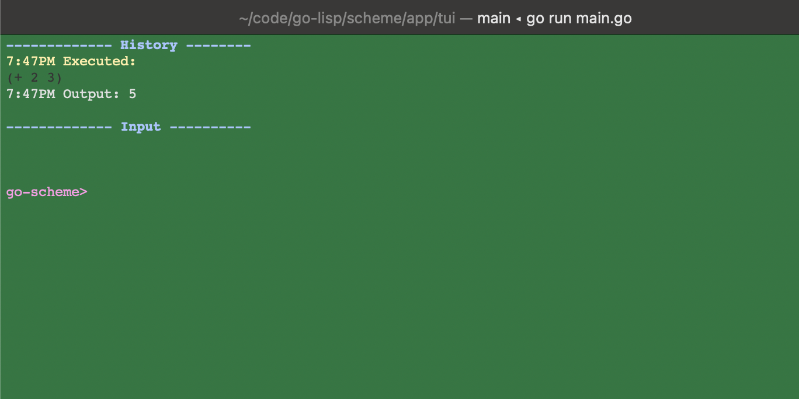

# go-lisp


# Description

A LISP interpreter hosted on go-lang. 
Initially I am focusing on the Scheme dialect since that's where I have the most
experience with lisp

## Scheme

### TUI
A text user interface to interact with the REPL. Currently at a hello world stage
```lisp
(format t "hello world")
```
prints `hello world` in the TUI when evaluated

#### Entry
Enter an expression at the prompt and press enter to pend it for evaluation.
This allows you to write multi-line expressions and have them evaluated when you are done.

[](./static/images/tui/expression-entry.png)

#### Pending
Expressions that have been entered but not yet evaluated are shown in the pending section.
This allows you to see what expressions are waiting to be evaluated and in what order they will be evaluated.
[](./static/images/tui/expression-pending.png)

#### Evaluate
Pressing [ctrl + s] will evaluate the next pending expression and show the result in the output section.
[](./static/images/tui/expression-evaluate.png)

### REPL

#### Display
Interactive loop to evaluate expressions. Currently at a hello world stage
```lisp
(format t "hello world")
```
Literals resolve to their own value
```lisp
("hello")
```
prints `hello`

```lisp
(1234)
```
prints `1234`

#### Math with Integer literals
```lisp
(+ 1 2)
```
prints `3`
```lisp
(- 5 2)
```
prints `3`
```lisp
(* 3 4)
```
prints `12`
```lisp
(/ 10 2)
```
prints `5`

#### Compound Expressions
```lisp
(+ (* 2 3) (/ 10 2))
```
prints `11`

#### Define Global Variables
```lisp
(define x 10)
```
defines a global variable `x` with the value `10`
```lisp
(+ x 5)
```
prints `15`

### Bind Variables
```lisp
(let ((x 10) (y 20))
  (+ x y))
```
prints `30`

